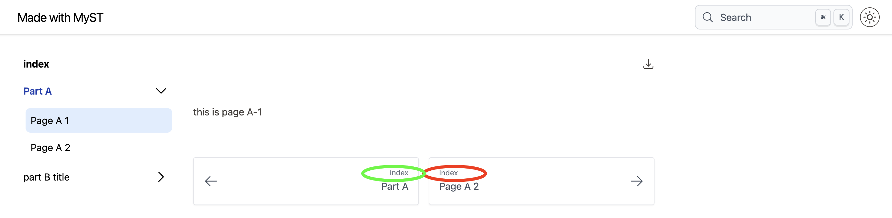
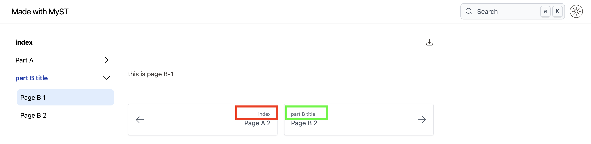

# mystmd
Repository created to illustratie issue "Hierachy in toc not respected when using children of file" on https://github.com/jupyter-book/mystmd/

# Summary

The hierarchy is respected in case of a title with children

The hierarchy is not respected in case of a file with children

This seems inconsistent to me. I'd expect the hierachy to be respected in all cases.

# Observed behaviour

Page A 1

Page B 2

# Expected behaviour

Red ellipse on page A-1 should be "Part A" instead of "index"

Red rectangle on page B-1 should be "Part A" instead of "index"

